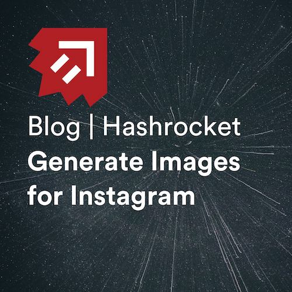

Today I released a post on the Hashrocket blog, [Generate Images for
Instagram](https://hashrocket.com/blog/posts/generate-images-for-instagram).

It documents a project I made to generate Hashrocket-branded images for social
media. The program has two components: a web app and a CLI, both powered by
ImageMagick.

Here's a sample of the kind of image this project can create:

Thanks for reading.
